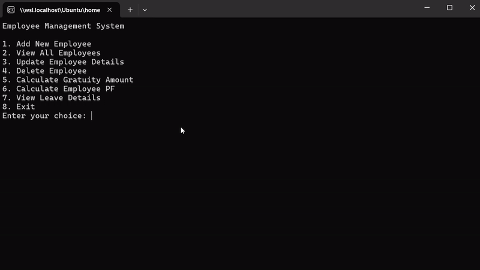

# Employee Management System

This is a console application implemented in C# using .NET 6. It's an Employee Management System that allows you to perform various operations related to employees.

## Features

The system provides the following options:

1. Add New Employee
2. View All Employees
3. Update Employee Details
4. Delete Employee
5. Calculate Gratuity Amount
6. Calculate Employee PF
7. View Leave Details
8. Exit

## Implementation

The system uses an interface called `GovtRules` which defines methods for calculating Employee PF, viewing leave details, and calculating the gratuity amount. The interface provides the following methods:

- `EmployeePF(double basicSalary)`: This method calculates the employee's Provident Fund (PF) based on the provided basic salary.
- `LeaveDetails()`: This method returns a string describing the leave details for an employee.
- `gratuityAmount(float serviceCompleted, double basicSalary)`: This method calculates the gratuity amount based on the service years completed and the basic salary.

The `GovtRules` interface is implemented in classes like `ABC` and `XYZ`, which each have their own specific rules for calculating PF, leave, and gratuity.

### Class ABC:

- Data Members: `empid`, `name`, `dept`, `desg`, and `basicSalary` are set through a parameterized constructor.
- Employee PF Calculation: 12% of the basic salary goes to the employee's PF. Additionally, 8.33% of the basic salary is contributed by the employer to the PF, with 3.67% of the employer contribution going to the Pension Fund.
- Leave Details: For employees in the ABC class:
    - 1 day of Casual Leave per month.
    - 12 days of Sick Leave per year.
    - 10 days of Privilege Leave per year.
- Gratuity Amount: The gratuity amount is calculated based on years of service:
    - If the employee has completed more than 5 years of service, 1 month of basic salary is deposited into the gratuity fund.
    - If more than 10 years of service have been completed, the gratuity amount is equal to 2 months' basic salary.
    - If more than 20 years of service have been completed, the gratuity amount is equal to 3 months' basic salary.
    - If less than 5 years of service have been completed, there is no gratuity amount.

### Class XYZ:

- Data Members: `empid`, `name`, `dept`, `desg`, and `basicSalary` are set through a parameterized constructor.
- Employee PF Calculation: 12% of the basic salary goes to the employee's PF. Additionally, 12% of the employer's contribution goes to the PF.
- Leave Details: For employees in the XYZ class:
    - 2 days of Casual Leave per month.
    - 5 days of Sick Leave per year.
    - 5 days of Privilege Leave per year.
- Gratuity Amount: Gratuity is not applicable for employees in the XYZ class.

## Demo

## How to Run

Ensure you have .NET 6 installed on your machine. 

1. Open a terminal.
2. Navigate to the project directory using `cd /GenSpark/Day6\ -\ Apr\ 16/`.
3. Run the program using the command `dotnet run`.
