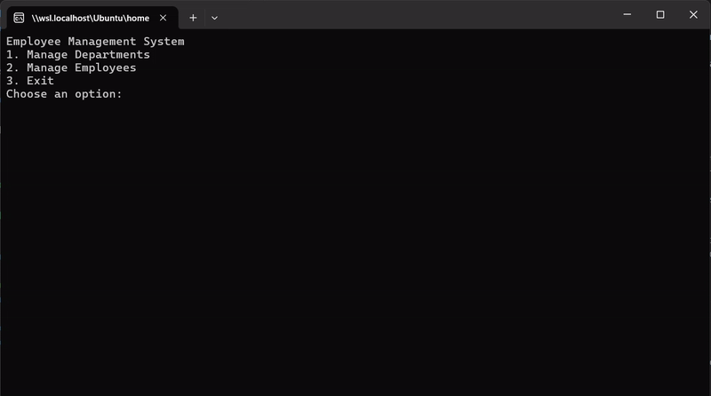

# Request Tracker Application

This is a robust console application developed in C#. The Request Tracker Application is designed to manage departments and employees in an organization.

## Features

The system offers a comprehensive suite of features:

1. **Manage Departments**: Add, update, view, and delete department records.
2. **Manage Employees**: Add, update, view, and delete employee records.
3. **Exception Handling**: Handle exceptions like duplicate department names, employee not found, and department not found.

## Implementation

The system is divided into three layers:

1. **Model Library**: This layer contains the data models for `Department` and `Employee`.
2. **Data Access Layer (DALLibrary)**: This layer contains repositories for all the entities. It interacts with the database and performs CRUD operations.
3. **Business Logic Layer (BLLibrary)**: This layer contains the business logic of the application. It interacts with the DAL and transforms data to and from the Models.

## Custom Exception Handling
The application includes custom exception handling to manage specific scenarios that may occur during the execution of the program. These custom exceptions include:

1. **DuplicateDepartmentException**: This exception is thrown when an attempt is made to add a department with a name that already exists in the system.
2. **EmployeeNotFoundException**: This exception is thrown when an operation is attempted on an employee that does not exist in the system.
3. **DepartmentNotFoundException**: This exception is thrown when an operation is attempted on a department that does not exist in the system.

These custom exceptions help to provide more specific error messages and allow for more precise error handling in the application.

## TOPIC COVERED
The selfLearnSolution demonstrates various programming concepts like polymorphism, function overloading, function overriding, class, structure, enum, records, abstract class, indexers, jagged array, exception handling, and custom exception.

## Demo

## Getting Started

To run this application, ensure you have .NET 6 installed on your machine. 

1. Open a terminal.
2. Navigate to the project directory using `cd Day8\ -\ Apr\ 18/RequestTrackerSolution/`.
3. Run the program using the command `dotnet run`.
