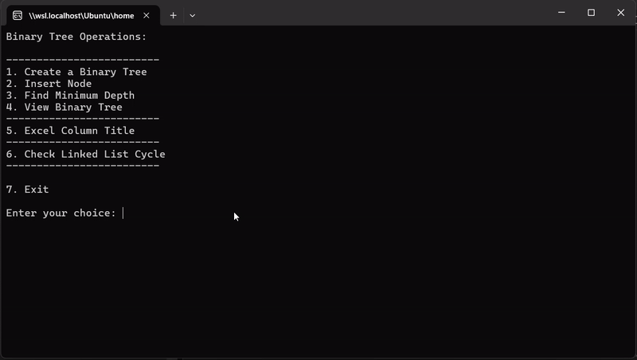

# LeetCode Problems

## Overview

This repository is dedicated to solving various coding problems from LeetCode. The tasks for the day include solving problems related to binary trees, Excel sheet column titles, and linked lists.

## Tasks

### 1. Minimum Depth of Binary Tree

Problem statement: Given a binary tree, find its minimum depth. The minimum depth is the number of nodes along the shortest path from the root node down to the nearest leaf node.

Problem link: [Minimum Depth of Binary Tree - LeetCode](https://leetcode.com/problems/minimum-depth-of-binary-tree/description/)

```
//Solution.cs

namespace MinimumDepthOfBinaryTree
{
    public class Solution
    {
        public static async Task<int> MinDepth(TreeNode? root)
        {
            if (root == null)
            {
                return 0;
            }
            if (root.left == null && root.right == null)
            {
                return 1;
            }
            if (root.left == null)
            {
                return await MinDepth(root.right) + 1;
            }
            if (root.right == null)
            {
                return await MinDepth(root.left) + 1;
            }
            var leftDepth = MinDepth(root.left);
            var rightDepth = MinDepth(root.right);
            await Task.WhenAll(leftDepth, rightDepth);
            return Math.Min(leftDepth.Result, rightDepth.Result) + 1;
        }
    }
}

```

### 2. Excel Sheet Column Title

Problem statement: Given a positive integer, return its corresponding column title as appear in an Excel sheet.

Problem link: [Excel Sheet Column Title - LeetCode](https://leetcode.com/problems/excel-sheet-column-title/description/)

```
namespace ExcelSheet
{
    public class Excel
    {
        public static string ExcelColumnTitle(int columnNumber)
        {
            const string chars = "ABCDEFGHIJKLMNOPQRSTUVWXYZ";
            string result = "";
            while (columnNumber > 0)
            {
                columnNumber--;
                var remainder = columnNumber % 26;
                result = chars[remainder] + result;
                columnNumber /= 26;
            }
            return result;
        }
    }
}

```

### 3. Linked List Cycle

Problem statement: Given head, the head of a linked list, determine if the linked list has a cycle in it. There is a cycle in a linked list if there is some node in the list that can be reached again by continuously following the next pointer.

Problem link: [Linked List Cycle - LeetCode](https://leetcode.com/problems/linked-list-cycle/description/)

```
// Slow and Fast Pointer

 public static async Task<bool> HasCycle(ListNode head)
 {
     if (head == null || head.next == null)
         return false;

     ListNode slow = head;
     ListNode fast = head.next;

     while (slow != fast)
     {
         if (fast == null || fast.next == null)
             return false;

         slow = slow.next!;
         fast = fast.next!.next!;
     }

     await Task.Delay(0);

     return true;
 }
```

## Demo



## Getting Started

To run this application, ensure you have .NET 6 installed on your machine. 

1. Open a terminal.
2. Navigate to the project directory using `cd Day 14\ -\ Apr\ 29/LeetCodeAppSolution/`.
3. Run the program using the command `dotnet run`.
