# SQL Queries Assignment

This assignment involves writing SQL queries to extract specific information from a database. The database is named 'pubs' and contains several tables, including 'titles' and 'authors'.

## pgexercises - basic

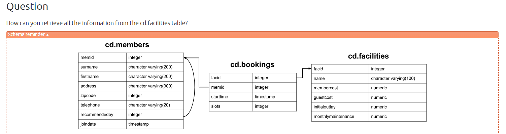
```
select * from cd.facilities;       
```

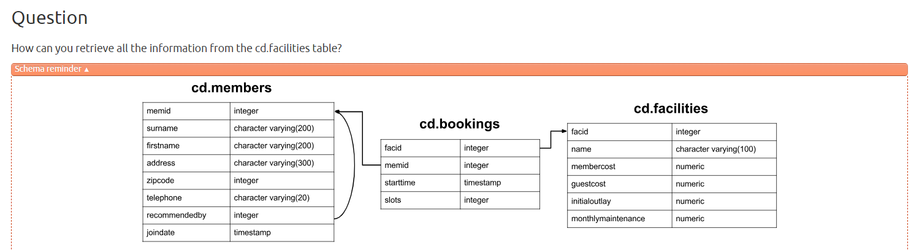
```
select name, membercost from cd.facilities;  
```
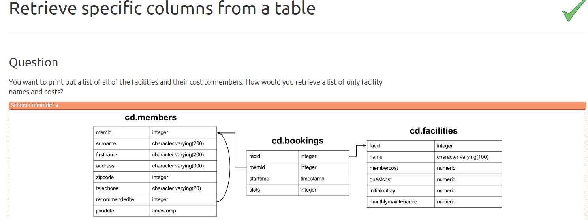
```
select * from cd.facilities where membercost > 0;    
```
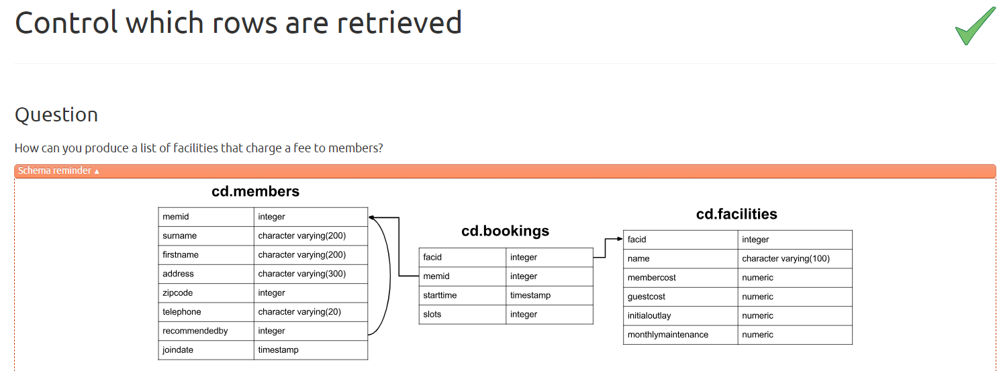
```
SELECT
  facid,
  "name",
  membercost,
  monthlymaintenance
FROM
  cd.facilities
WHERE
  membercost > 0
  AND membercost < monthlymaintenance / 50;
```
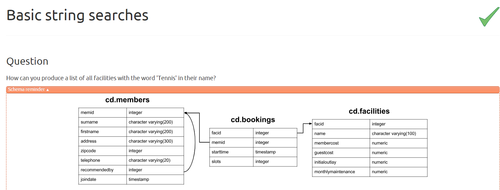
```
SELECT *
FROM cd.facilities
WHERE "name" LIKE '%Tennis%';
```
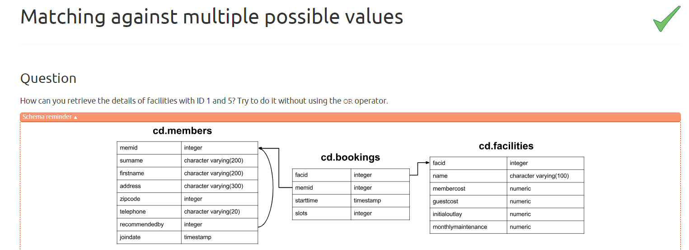
```
SELECT *
FROM cd.facilities
WHERE facid IN (1, 5);
```
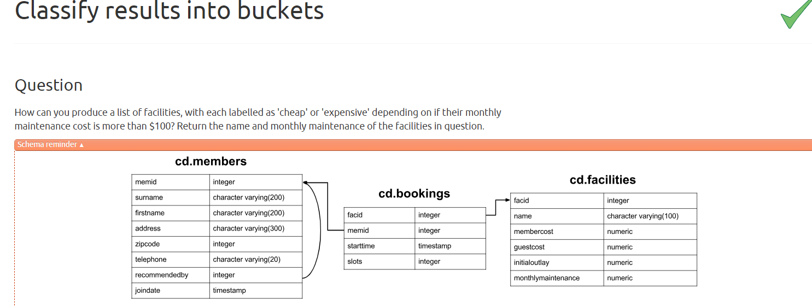
```
SELECT
  "name",
  CASE
    WHEN monthlymaintenance > 100 THEN 'expensive'
    ELSE 'cheap'
  END AS "cost"
FROM
  cd.facilities;
```
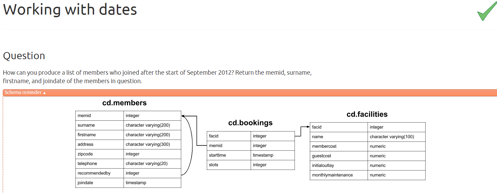
```
SELECT
  memid,
  surname,
  firstname,
  joindate
FROM
  cd.members
WHERE
  joindate >= '2012-09-01';
```
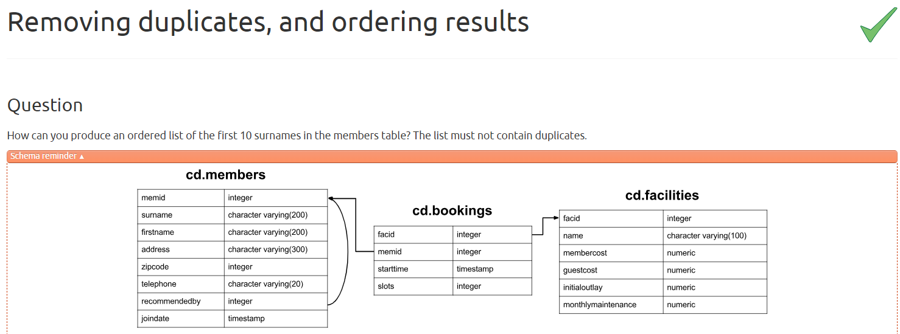
```
SELECT DISTINCT surname
FROM cd.members
ORDER BY surname
LIMIT 10;
```
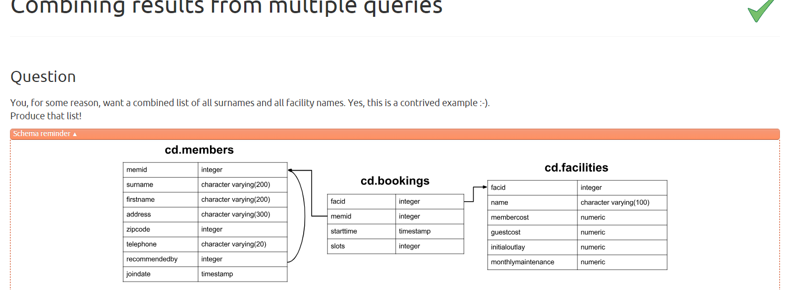
```
SELECT surname FROM cd.members

UNION DISTINCT

SELECT name FROM cd.facilities;
```
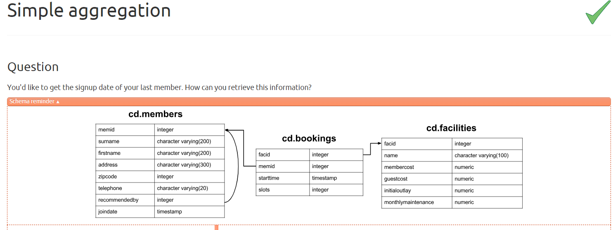
```
SELECT MAX(joindate) AS latest
FROM cd.members;
```
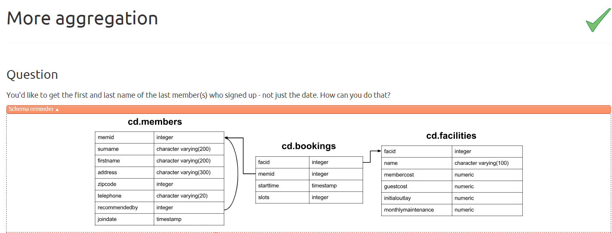
```
SELECT
  firstname,
  surname,
  joindate
FROM
  cd.members
WHERE
  joindate = (SELECT MAX(joindate) FROM cd.members);
```
## Queries

1) Print all the titles names
```
SELECT title FROM titles;

``` 
2) Print all the titles that have been published by 1389
 ```
 SELECT * FROM titles WHERE pub_id = '1389';

```
3) Print the books that have price in rangeof 10 to 15
 ```
 SELECT * FROM titles WHERE price >= 10 AND price<=15;
--(or)
SELECT * FROM titles WHERE price BETWEEN 10 AND 15;

```
4) Print those books that have no price
 ```
 SELECT * FROM titles WHERE price IS NULL;

```
5) Print the book names that strat with 'The'
 ```
 SELECT * FROM titles WHERE title LIKE 'The%';
--(or)
SELECT title FROM titles WHERE title LIKE 'The%';
```
6) Print the book names that do not have 'v' in their name
 ```
 SELECT title FROM titles WHERE title NOT LIKE '%v%';
--(or)
SELECT * FROM titles WHERE title NOT LIKE '%v%';

```
7) print the books sorted by the royalty
 ```
 SELECT * FROM titles ORDER BY royalty;
--(or)
SELECT title FROM titles ORDER BY royalty; 
```
8) print the books sorted by publisher in descending then by types in asending then by price in descending
 ```
  SELECT * FROM titles ORDER BY pub_id DESC, type ASC, price DESC;

```
9) Print the average price of books in every type
 ```
  SELECT type, AVG(price) AS avg_price FROM titles GROUP BY type;

```
10) print all the types in uniques
 ```
 SELECT DISTINCT type FROM titles;

--(or)
SELECT type 
FROM titles 
GROUP BY type;

--(or)

SELECT type
FROM titles
WHERE type NOT IN (
    SELECT type
    FROM titles
    GROUP BY type
    HAVING COUNT(*) > 1
);

```
11) Print the first 2 costliest books
 ```
 SELECT TOP 2 * FROM titles ORDER BY price DESC;

```
12) Print books that are of type business and have price less than 20 which also have advance greater than 7000
 ```
 SELECT title FROM titles WHERE type = 'business' AND price < 20 AND advance > 7000;

```
13) Select those publisher id and number of books which have price between 15 to 25 and have 'It' in its name. Print only those which have count greater than 2. Also sort the result in ascending order of count
 ```
 
SELECT pub_id, COUNT(title_id)
FROM titles 
WHERE price BETWEEN 15 AND 25 
AND title LIKE '%It%'
GROUP BY pub_id
HAVING COUNT(title_id) > 2
ORDER BY COUNT(title_id) ASC;

--(or)
SELECT pub_id, COUNT(*) AS 'total books'
FROM titles 
WHERE price BETWEEN 15 AND 25 AND title LIKE '%It%'
GROUP BY pub_id
HAVING COUNT(*) > 2
ORDER BY [total books] ASC;

```
14) Print the Authors who are from 'CA'
 ```
 SELECT *
FROM authors 
WHERE state = 'CA';

SELECT au_fname,au_lname
FROM authors 
WHERE state = 'CA';
```
15) Print the count of authors from every state
 ```
 SELECT state, COUNT(*) AS 'number of authors'
FROM authors 
GROUP BY state;

--(or)
SELECT state, COUNT(DISTINCT au_id) AS 'number of authors'
FROM authors 
GROUP BY state;
```
