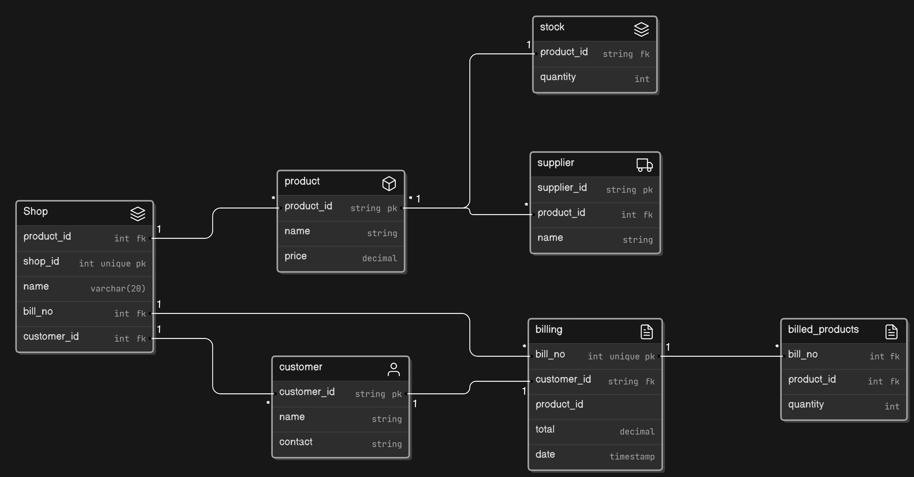
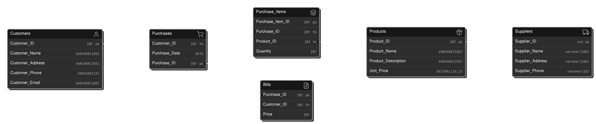
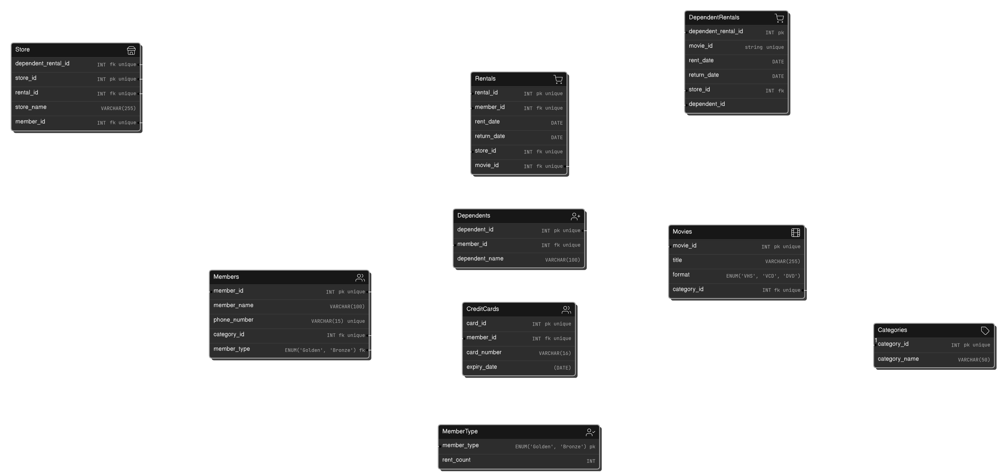

# Shop Inventory and Billing System

This system is designed to record the stock available and billed in a shop. The system minimizes the amount of customer data required and allows for multiple suppliers for a single product. A single supplier can also supply many products.

* A shop want to record the stock available and billed in a shop.
* Customer data has to be minimum.
* One product could be supplied by multiple supplier.
* A Single supplier can supply many products.

## Entity Relationship Diagram (ERD)

* use dark mode 