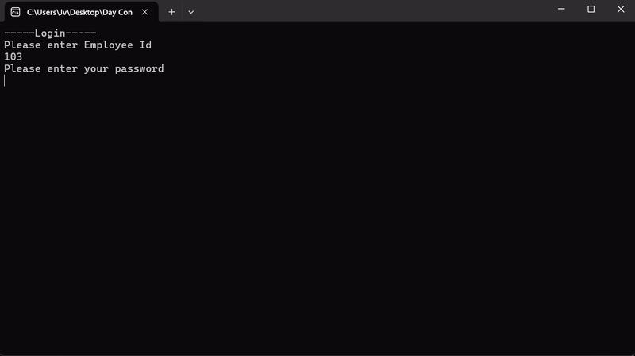
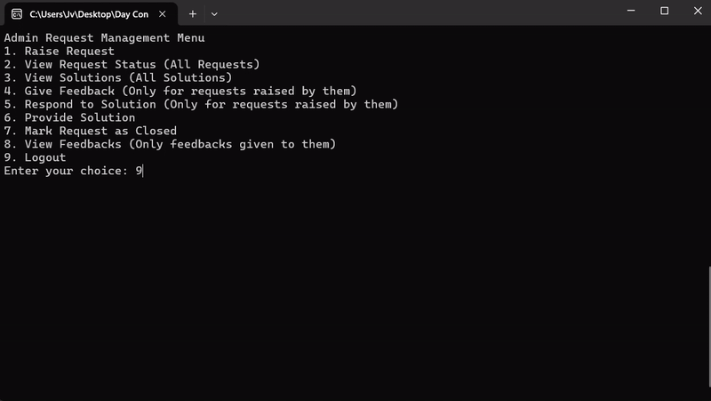
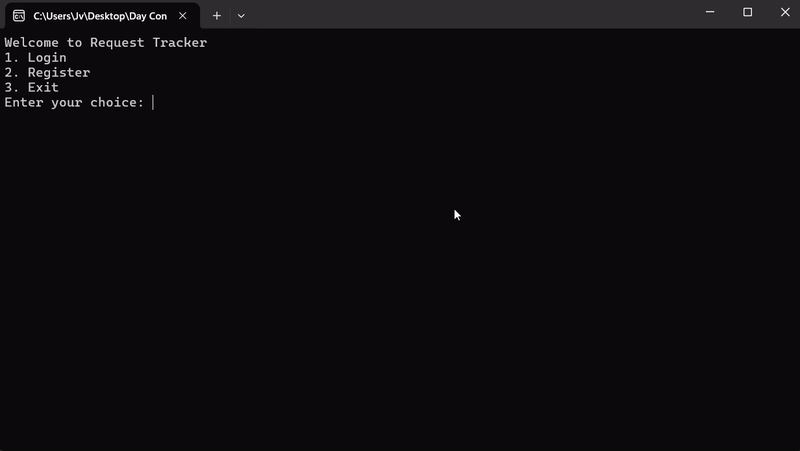

# Request Tracker Application

Request Tracker is a simple console application designed to help users and admins manage requests, solutions, feedback, and more.

## Tech Stack

- C#: The application is built using C# language.
- .NET Core/.NET Framework: The project utilizes the .NET Core or .NET Framework depending on the version used.
- Entity Framework Core: Entity Framework Core is used for database access and management, following the **code-first approach**.
- Microsoft SQL Server: The application uses Microsoft SQL Server as the database backend.
- Console Interface: The user interacts with the application through a console interface.

## Setup

To set up the Request Tracker application, follow these steps:

1. Clone the Repository: Clone the repository to your local machine using `git clone`.

2. Navigate to the Project Directory: Open a terminal or command prompt and navigate to the project directory.

3. Restore Dependencies: Run `dotnet restore` to restore the project dependencies.

4. Run Migrations: Use Entity Framework Core migrations to create and update the database schema.
    - Run `dotnet ef migrations add InitialCreate` to create an initial migration.
    - Run `dotnet ef database update` to apply the migration and create the database schema.

5. Run the Application: Use the `dotnet run` command to run the application.

## Usage

Upon running the application, you will be prompted with a menu to either login or register.
After logging in, users and admins can perform various actions based on their roles.
### User Actions

- Raise Request
- View Request Status
- View Solutions
- Give Feedback
- Respond to Solution

### Admin Actions

- Raise Request
- View Request Status (All Requests)
- View Solutions (All Solutions)
- Give Feedback (Only for requests raised by them)
- Respond to Solution (Only for requests raised by them)
- Provide Solution
- Mark Request as Closed
- View Feedbacks (Only feedbacks given to them)

## Demo

Creating Requests

User Management

Admin Management

## Migration with 
Entity Framework

Entity Framework Core is used for database migrations and management.

To create a new migration, use the command `dotnet ef migrations add [MigrationName]`. 
After creating a migration, apply it to the database using `dotnet ef database update`.