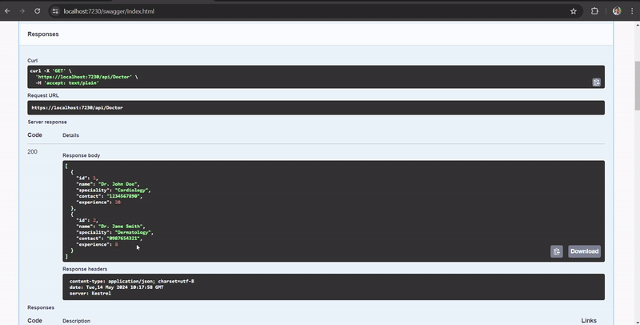

# Clinic Management API

This project is a part of the assessment for the Clinic Management API. It provides functionalities to manage doctors in a clinic, including listing doctors, updating doctor experience, and listing doctors based on their specialties.

## Technologies Used

- .NET 6
- ASP.NET Core Web API
- Entity Framework Core
- Microsoft SQL Server

## Project Structure

The project is structured as follows:

- ClinicManagementAPI: Contains the main ASP.NET Core Web API project.
    - Controllers: Contains the API controllers for handling HTTP requests.
    - Exceptions: Contains custom exception classes for error handling.
    - Interfaces: Contains interfaces defining contracts for services and repositories.
    - Models: Contains model classes representing entities in the application.
    - Repositories: Contains classes implementing data access logic.
    - Services: Contains classes implementing business logic.


## How to Run

1. Clone the repository to your local machine.
2. Open the solution file (ClinicManagement.sln) in Visual Studio or your preferred IDE.
3. Restore NuGet packages and build the solution.
4. Configure the database connection string in the appsettings.json file.
5. Run the database migrations to create the database schema:

     ```bash
     dotnet ef database update
     ```

6. Run the application. It will start a local web server hosting the API.
7. Use an API testing tool such as Postman to interact with the API endpoints.

## API Endpoints

- GET /api/doctor: Retrieve a list of all doctors.
- PUT /api/doctor/: Update the experience of a doctor.
- GET /api/doctor/specialty/{specialty}: Retrieve doctors based on their specialty.

## Demo



