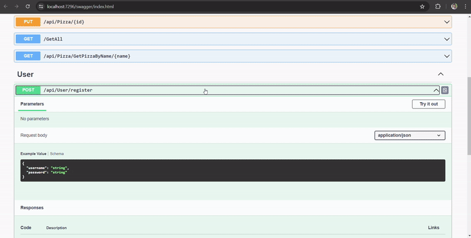
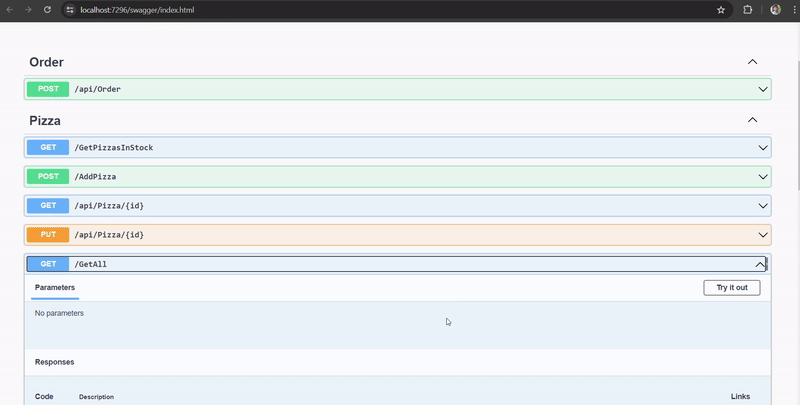

# Pizza Ordering API

This is a RESTful API for a pizza ordering system built with ASP.NET Core and Entity Framework Core. The API allows users to register, login, and place orders for pizzas. It also provides endpoints to manage users, pizzas, and orders.

## Features

- User registration and Login
- CRUD operations for users and pizzas
- Ordering pizzas

## Technologies Used

- ASP.NET Core
- Entity Framework Core
- SQL Server
- Swagger for API documentation

## API Endpoints

### User Endpoints

Endpoints

- **POST /register**: Register a new user
- **POST /login**: Login a user
- **GET /users/{id}**: Get a user by ID
- **GET /users**: Get all users
- **PUT /api/users/{id}**: Update a user

### Pizza Endpoints

Endpoints

- **GET /PizzasInStock**: Get available pizzas
- **POST /api/pizzas**: Create a new pizza
- **GET /api/pizzas/{id}**: Get a pizza by ID
- **GET /api/pizzas/name/{name}**: Get a pizza by name
- **GET /api/pizzas**: Get all pizzas
- **PUT /api/pizzas/{id}**: Update a pizza

### Order Endpoints

Endpoints

- **POST /api/orders**: Create a new order

## DEMO

Login / Register

GetInStock

