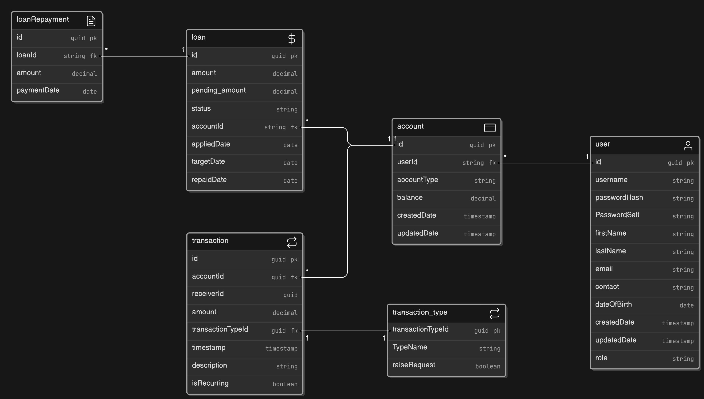

# MINI PROJECT PROGRESS

## Simple Banking System (Basic Outline)

### Overview

Simple Banking System is a web-based backend application using ASP.NET Core Web API  for creating RESTful services. It aims to provides basic banking functionalities such as user management, account management, and transaction management and Loan Management. The application utilizes Entity Framework Core for data management, Service layer for business logic and incorporates JSON Web Tokens (JWT) for authentication. API documentation can be created through Swagger and Postman.

### Expected Features

#### User Management

- **User Registration:** Users can register for a new account by providing necessary details, will be activated by admin after background verification.
- **User Login/Sessions:** Users can log in to their accounts securely and Sessions handled with cookies, logout
- **View/Edit User Profile:** Users can view and update their profile information. (Update each Account passwords) , update details related to profile (address) with admin approvals

#### Account Management

- **Open a New Account:** Users can open various types of accounts such as savings, salary, etc.
- **View Account Details:** Users can view details of their accounts including balance and transaction history.
- **Request to Close an Account:** Users can raise request to close an account if they no longer need it.
- **List All Accounts for a User:** Users can see a list of all their accounts.
- **Manage Account Details** Change transaction password , other details

#### Transaction Management

- **Deposit Money:** Users can deposit money into their accounts.
- **Withdraw Money:** Users can withdraw money from their accounts.
- **Transfer Money Between Accounts:** Users can transfer money between their own accounts or to other users (Instant / NEFT / RTFS ).
- **Repay Loan:** Users can make repayments towards their outstanding loans. (with interests (BL))
- **View Transaction History:** Users can view a history of transactions made on their accounts.

#### Loan Management

- **Apply for a Loan:** Users can apply for a loan with specified details such as amount and repayment terms.
- **View Loan Status:** Users can view the status of their loan applications and approved loans.
- **Manage Loans:** Users can track the loans they applied so far
- **View Loan Repayment History**: Users can view a history of loan repayments.

#### Administrative Functions (Admin User)

- **View All Users:** Admin users can view a list of all registered users.
- **Manage User Accounts:** Admin users can manage user accounts such as opening / deleting / closing user accounts.
- **Assign Roles and Permissions:** Admin users can assign roles and permissions to other users.
- **View All Accounts:** Admin users can view a list of all accounts in the system.
- **Manage Accounts:** Admin users can perform actions such as deleting / closing accounts related to users.
- **View All Transactions:** Admin users can view a list of all transactions in the system.
- **Approve Certain Transactions**  Admins can approve RTFS/NEFT transactions , if user has submitted any.
- **Approve/Deny Loan Applications:** Admin users can approve or deny loan applications submitted by users.
- **Manage Loan Repayments:** Admin users can manage loan repayments including marking them as received / Charging them for late payments, etc.

### Extended Complex Features
- Cards (debit/credit)
- Scheduled Transactions 
- Budgeting and Expense Tracking (SQL Aggregations)
- Data Encryption

## Technologies

- ASP.NET Core Web API
- Entity Framework Core
- SQL Server
- JSON Web Tokens (JWT) for authentication
- Swagger & Postman for API documentation

## Projected ERD 
- ERD

- Class Diagram

