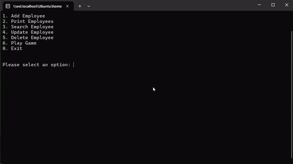

# Employee Management and Word Game Console Application

This is a console application implemented in C#. It includes an Employee Management System and a Word Game.

## Employee Management System

The Employee Management System allows you to perform CRUD operations on Employee objects. The features include:

- Adding an Employee
- Printing all Employees
- Searching for an Employee by ID
- Updating an Employee's name
- Deleting an Employee

## Word Game

The Word Game is a guessing game where the user tries to guess a word. The game provides hints in the form of "cows" and "bulls". A "cow" means the guess has a correct character in the correct position. A "bull" means the guess has a correct character but in the wrong position.

For example, if the word is "golf" and the guess is "goat", the hint would be "2 cows, 0 bulls" because "g" and "o" are correct and in the correct positions.

## How to Run

Ensure you have .NET 6 installed on your machine. 

1. Open a terminal.
2. Navigate to the project directory using `cd Day5\ -\ Apr\ 13/ `.
3. Run the program using the command `dotnet run`.

## Demo



## LEETCODE 

299. Bulls and Cows

You are playing the Bulls and Cows game with your friend.

You write down a secret number and ask your friend to guess what the number is. When your friend makes a guess, you provide a hint with the following info:

The number of "bulls", which are digits in the guess that are in the correct position.
The number of "cows", which are digits in the guess that are in your secret number but are located in the wrong position. Specifically, the non-bull digits in the guess that could be rearranged such that they become bulls.
Given the secret number secret and your friend's guess guess, return the hint for your friend's guess.

The hint should be formatted as "xAyB", where x is the number of bulls and y is the number of cows. Note that both secret and guess may contain duplicate digits.

```
public class Solution {
    public string GetHint(string secret, string guess) {
         var counts = new int[10];
            foreach (var ch in secret)
                counts[ch - '0']++;

            int a = 0, b = 0;
            for (int i = 0; i < guess.Length; i++)
            {
                if (guess[i] == secret[i])
                {
                    a++;
                    if (counts[guess[i] - '0'] > 0)
                        counts[guess[i] - '0']--;
                    else
                        b--;
                    continue;
                }

                if (counts[guess[i] - '0'] > 0)
                {
                    b++;
                    counts[guess[i] - '0']--;
                }
            }

            return $"{a}A{b}B";
    }
}
```