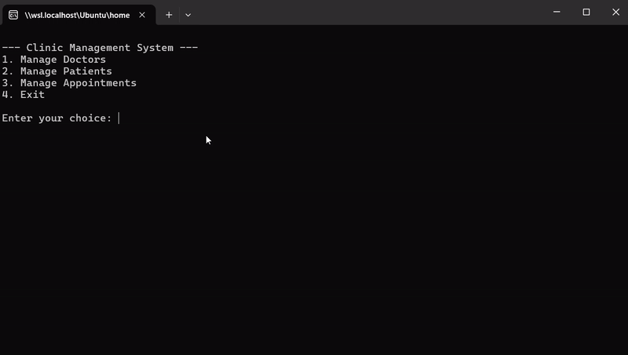

# Doctor's Clinic Appointment Management System

This is a 3-tier application implemented in C# using .NET 6. The system is designed to manage appointments for doctors in a clinic.

## Features

The system provides the following functionalities:

1. **Manage Doctors**: Add, update, view, and delete doctor records.
2. **Manage Patients**: Add, update, view, and delete patient records.
3. **Manage Appointments**: Schedule, update, view, and cancel appointments.

## Implementation

The system is divided into three layers:

1. **Models**: This layer contains the data models for `Doctor`, `Patient`, and `Appointment` with appropriate attributes.
2. **Data Access Layer (DAL)**: This layer contains repositories for all the entities. It interacts with the database and performs CRUD operations.
3. **Business Logic Layer (BLL)**: This layer contains the business logic of the application. It interacts with the DAL and transforms data to and from the Models.

### Models

- `Doctor`: Contains attributes like `DoctorId`, `Name`, `Specialization`, etc.
- `Patient`: Contains attributes like `PatientId`, `Name`, `Age`, etc.
- `Appointment`: Contains attributes like `AppointmentId`, `DoctorId`, `PatientId`, `AppointmentDate`, etc.

### Data Access Layer

The DAL contains repositories for each entity. Each repository has methods for adding, updating, deleting, and retrieving records from the database.

### Business Logic Layer

The BLL contains the business logic for managing doctors, patients, and appointments. It uses the repositories from the DAL to interact with the database.

## Demo

## How to Run

Ensure you have .NET 6 installed on your machine. 

1. Open a terminal.
2. Navigate to the project directory using `cd Day7\ -\ Apr\ 17/ClinicManagementSolution/`.
3. Run the program using the command `dotnet run`.
